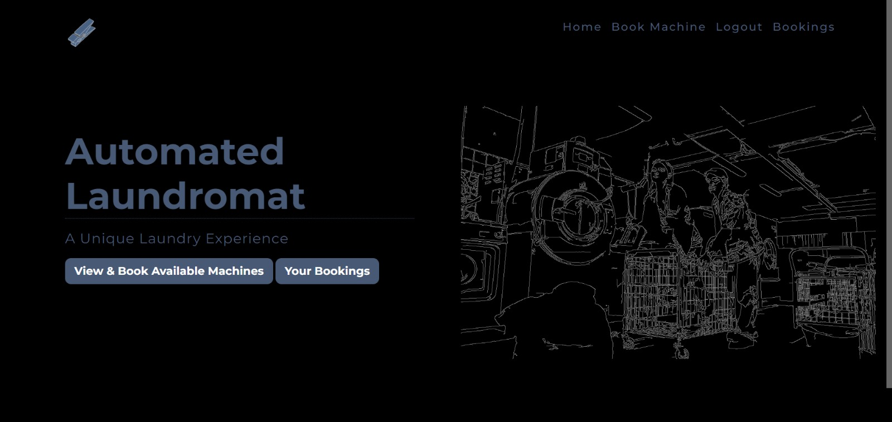
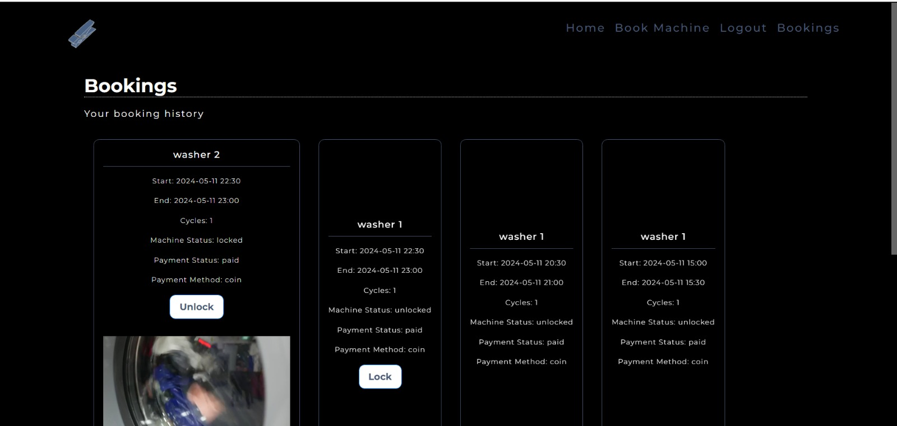

# Project description
The project is an implementation of an Automated Laundromat System (ALS) as part of the software engineering course at the American University of Sharjah (COE 420).

### Contributors
- Ahmed Alabd Aljabar - @00092885
- Ahmed Al Shadid - @00091777
- Hala Maadi - @00092771
- Omar Ibrahim - @00093225
- Said Iqelan - @00086701
- Supervisor: Dr. Hicham Hallal

### Features
- user dashboard
- scheduling algorithm
- reservation system
- integration with different payment gateways (Stripe and Phantom)

### Tech stack
- Flask (Python) -> Backend
    - Jinja2 -> Templating Engine
- MongoDB -> Database
- HTML, CSS, JS -> Frontend
    - Bootstrap -> CSS Framework
    - Full Calendar -> JS Calendar Library
- Stripe -> Payment Gateway
- Phantom -> Payment Gateway

### Sample screenshots



# Running instructions

### Setting up the MongoDB database on MongoDB Atlas (Free Tier)

To set up the MongoDB database on MongoDB Atlas (Free Tier), follow these steps:

1. Go to the MongoDB website at [https://www.mongodb.com](https://www.mongodb.com).

2. Sign up for an account or log in if you already have one.

3. Once logged in, navigate to the "Atlas" section.

4. Click on the "Get started for free" button to create a new MongoDB Atlas cluster.

5. Follow the prompts to configure your cluster. Choose the "Free Tier" option to use the free tier of MongoDB Atlas.

6. Select the cloud provider and region for your cluster. MongoDB Atlas supports multiple cloud providers such as AWS, Azure, and Google Cloud.

7. Configure additional settings such as cluster name, cluster tier, and storage size. You can leave the default values for now.

8. Click on the "Create Cluster" button to create your MongoDB Atlas cluster. This may take a few minutes.

9. Once the cluster is created, navigate to the "Database Access" section to create a new database user.

10. Click on the "Add New Database User" button and enter a username and password for your database user. Make sure to remember these credentials as you will need them to connect to your database.

11. In the "Network Access" section, click on the "Add IP Address" button and enter your IP address or CIDR block to allow access to your database from your current location.

12. Finally, in the "Clusters" section, click on the "Connect" button for your cluster and choose the "Connect your application" option.

13. Locate and copy the URI connection link

14. Create a file in the project directory called `.env`

15. Place the URI string in the file in the following format: `MONGODB_URI=<YOUR_URI_GOES_HERE>`

### Installing dependencies

Open a terminal in the project directory and run the following commands in order:
```bash
python -m venv venv
source venv/bin/activate  # for Linux/Mac
venv\Scripts\activate  # for Windows
pip install -r requirements.txt
```

### Running the webserver

After setting up MongoDB and installing all dependencies you may run the application using the following command

```bash
python app.py
```